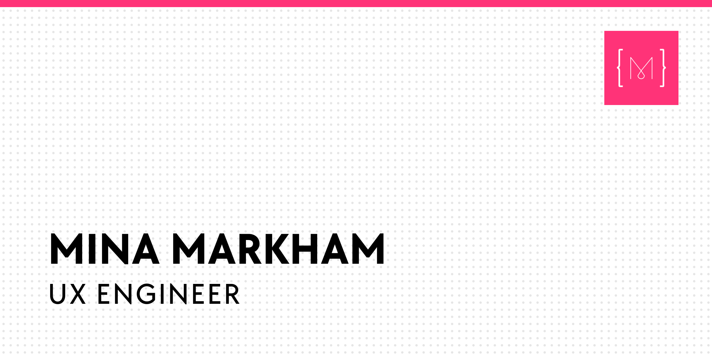

  
  <h1>cupcake, a personal site.</h1>
  
Source code for <a href="https://mina.codes/" target="_blank">mina.codes</a>, my personal website.

  <h3>Current flavor: <a href="https://github.com/minamarkham/cupcake/tree/6.0%E2%80%94banana-creme">banana creme</a></h3>

  

  

    Previous flavors:
    <a href="https://2006.mina.codes/" target="_blank">vanilla</a>,
    <a href="https://2008.mina.codes/" target="_blank">chocolate</a>,
    <a href="https://2011.mina.codes/" target="_blank">strawberry</a>,
    <a href="https://2012.mina.codes/" target="_blank">lemon</a>,
    and <a href="https://2013.mina.codes/" target="_blank">red velvet</a>.
  

 

## License

This is my personal website. I'm keeping the source code open for transparency, but this is not a template. You're free to re-use __parts of this codebase__ in your own site, with attribution. Just __don't copy the entire thing__, replace the content and publish it.

You know, don't be a dick.
